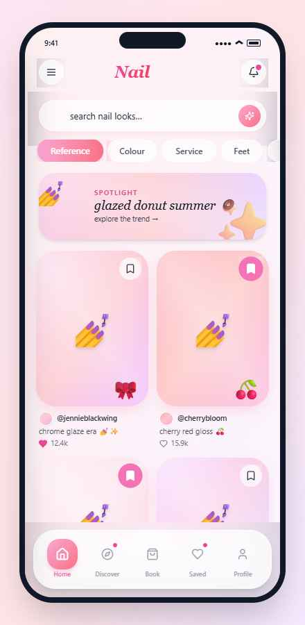

# Nail Palette

A mobile UI prototype for a nail-art discovery and booking app — the "I saw a cute nail look → I booked the appointment" flow in a single screen. Built as a self-contained React prototype styled with Tailwind, rendered inside a faux-iPhone frame.

  

> **Want to see the product?** Take a look in the [`screenshots/`](screenshots) folder, or open the live prototype below to click through it yourself.

## View it

Open **`Nail Palette (shareable).html`** in any modern browser — it's a self-contained build (needs internet only for the Tailwind stylesheet). Click through the feed, discover, booking, reviews, and profile screens.

## Files

- `Nail Palette (shareable).html` — self-contained build, just open it in a browser
- `Nail Palette.html` — dev version (loads `app.jsx` in the browser)
- `app.jsx` — the React component code
- `DOCS.md` — full design spec (palette, type scale, screens, interactions)
- `screenshots/` — preview images of the app

## Tech

- React 18 + Tailwind CSS
- lucide icons
- No build step — runs directly in the browser

## Note

All content (usernames, reviews, artists, salons) is fictional sample data for demo purposes.
